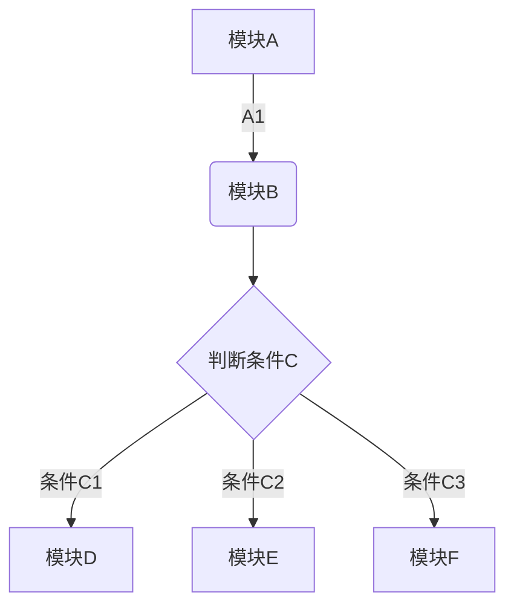
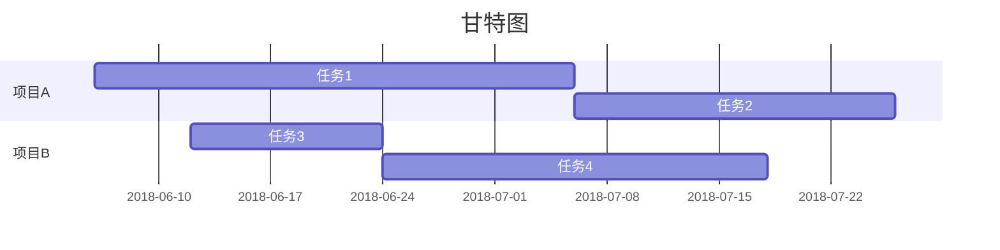

# 一级标题

## 二级标题

### 三级标题

#### 四级标题

* 符号列表
1. 数字列表
* [ ] 任务列表

- [x] 任务列表2

>内嵌代码
```C++
void main()
{

int x = 10;

++x;

cout<<x;
}
```

[链接文本-www.baidu.com](www.baidu.com)



$$e^{i\pi} + 1 = 0$$
$$
E_{\rm k}=\frac{1}{2}m v^2
\tag{1.1}
$$
$$

sin 2x = 2\cos x\sin x

$$
